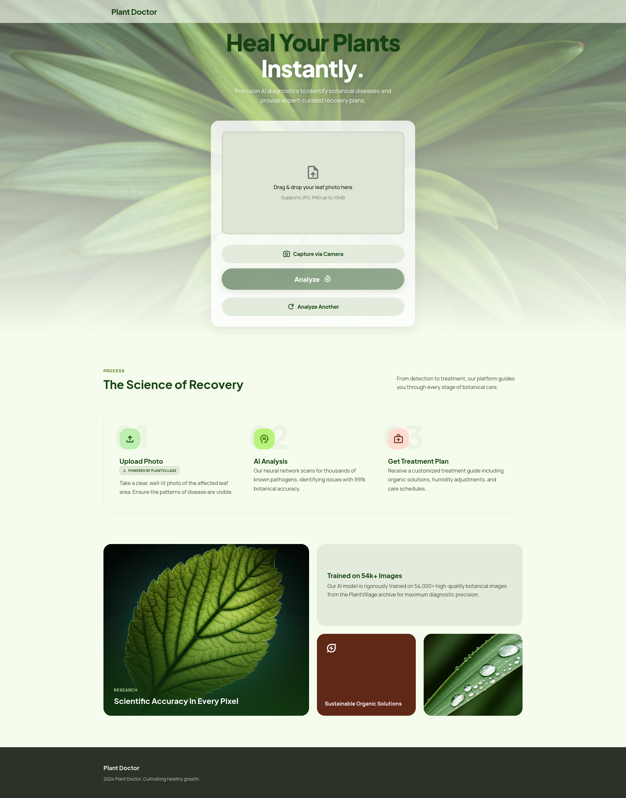
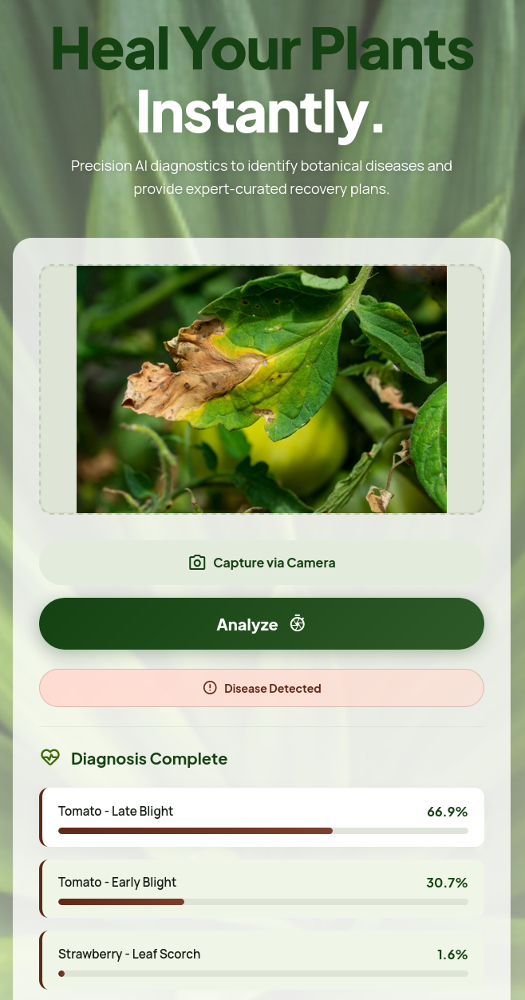
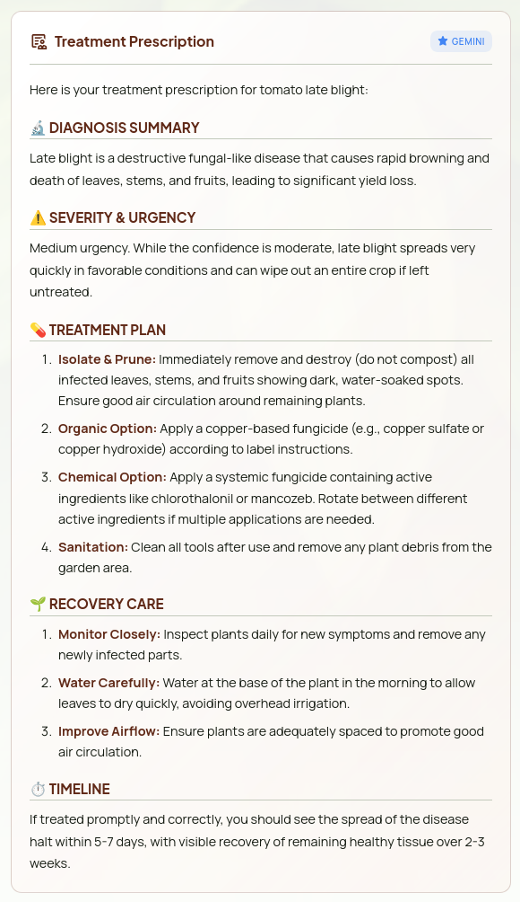

# Plant Doctor

AI-powered plant disease detection in your browser with instant treatment prescriptions.

[](https://onnxruntime.ai/)
[](https://ai.google.dev/)
[](https://vercel.com/)
[](https://developer.mozilla.org/en-US/docs/Web/JavaScript)
[](https://developer.mozilla.org/en-US/docs/Web/CSS)

**Live Demo:** [https://adhyai-hackathon.vercel.app](https://adhyai-hackathon.vercel.app)

> Built for **AdhyAI Hackathon** by Think India

---

## Demo

| Main Interface | Disease Detection | Treatment Prescription |
|:--------------:|:-----------------:|:----------------------:|
|  |  |  |

*Add your screenshots to the `screenshots/` folder*

---

## Features

- **Browser-Based ML Inference** - Runs entirely in your browser using ONNX Runtime Web (WebAssembly). No server-side processing needed for predictions.

- **38 Plant Disease Classifications** - Trained on the PlantVillage dataset covering 14 plant species and 38 disease/healthy classes.

- **AI-Generated Treatment Prescriptions** - Powered by Google Gemini 2.5 Flash API. Get detailed treatment plans for diseased plants or maintenance schedules for healthy ones.

- **Multiple Input Methods** - Drag & drop images or capture directly via camera on mobile devices.

- **Botanical Archivist Design** - Elegant glassmorphic UI with smooth animations and a botanical color palette.

- **Fully Responsive** - Works seamlessly on desktop, tablet, and mobile devices.

---

## Tech Stack

| Category | Technology |
|----------|------------|
| Frontend | HTML5, CSS3, Vanilla JavaScript |
| ML Runtime | ONNX Runtime Web (WebAssembly) |
| Model Architecture | MobileNetV2 (PyTorch → ONNX) |
| AI Prescriptions | Google Gemini 2.5 Flash |
| Deployment | Vercel (Serverless Functions) |

---

## Model Training Details

| Metric | Value |
|--------|-------|
| Dataset | PlantVillage (54,305 images) |
| Classes | 38 (diseases + healthy) |
| Architecture | MobileNetV2 (ImageNet pretrained) |
| Framework | PyTorch |
| Validation Accuracy | 97.96% |
| Test Accuracy | 99% |
| Model Size | 8.7 MB (ONNX format) |
| Input Size | 224 × 224 RGB |

### Training Pipeline

1. **Data Augmentation**: Random horizontal flip, rotation (±15°), color jitter
2. **Transfer Learning**: MobileNetV2 backbone with frozen early layers
3. **Optimization**: Adam optimizer with learning rate scheduling
4. **Export**: PyTorch → ONNX conversion for web deployment

---

## Supported Plants & Diseases

The model can identify **38 classes** across **14 plant species**:

| Plant | Classes | Conditions |
|-------|:-------:|------------|
| Apple | 4 | Scab, Black Rot, Cedar Apple Rust, Healthy |
| Blueberry | 1 | Healthy |
| Cherry | 2 | Powdery Mildew, Healthy |
| Corn | 4 | Cercospora Leaf Spot, Common Rust, Northern Leaf Blight, Healthy |
| Grape | 4 | Black Rot, Esca (Black Measles), Leaf Blight, Healthy |
| Orange | 1 | Huanglongbing (Citrus Greening) |
| Peach | 2 | Bacterial Spot, Healthy |
| Pepper (Bell) | 2 | Bacterial Spot, Healthy |
| Potato | 3 | Early Blight, Late Blight, Healthy |
| Raspberry | 1 | Healthy |
| Soybean | 1 | Healthy |
| Squash | 1 | Powdery Mildew |
| Strawberry | 2 | Leaf Scorch, Healthy |
| Tomato | 10 | Bacterial Spot, Early Blight, Late Blight, Leaf Mold, Septoria Leaf Spot, Spider Mites, Target Spot, Mosaic Virus, Yellow Leaf Curl Virus, Healthy |

---

## Getting Started

### Prerequisites

- A modern web browser (Chrome, Firefox, Safari, Edge)
- [Google Gemini API Key](https://aistudio.google.com/app/apikey) (for treatment prescriptions)
- Node.js (optional, for local development server)

### Local Development

1. **Clone the repository**
   ```bash
   git clone https://github.com/Kshitij-K-Singh/AdhyAI-Hackathon.git
   cd AdhyAI-Hackathon
   ```

2. **Set up environment variables**
   ```bash
   cp .env.example .env
   ```
   Edit `.env` and add your Gemini API key:
   ```
   GEMINI_API_KEY=your_gemini_api_key_here
   ```

3. **Serve the application**
   
   Using Python:
   ```bash
   python -m http.server 8000
   ```
   
   Using Node.js:
   ```bash
   npx serve
   ```
   
   Using VS Code: Install "Live Server" extension and click "Go Live"

4. **Open in browser**
   ```
   http://localhost:8000
   ```

> **Note**: The Gemini prescription feature requires the Vercel serverless function. For local testing of prescriptions, you'll need to use Vercel CLI (`vercel dev`).

---

## Deployment

### Deploy to Vercel

1. **Push to GitHub**
   ```bash
   git add .
   git commit -m "Initial commit"
   git push -u origin main
   ```

2. **Import in Vercel**
   - Go to [vercel.com/new](https://vercel.com/new)
   - Click "Import Git Repository"
   - Select your repository
   - Click "Deploy"

3. **Configure Environment Variable**
   - Go to Project Settings → Environment Variables
   - Add new variable:
     - **Name**: `GEMINI_API_KEY`
     - **Value**: Your Gemini API key
     - **Environment**: Production, Preview, Development

4. **Redeploy**
   - Go to Deployments tab
   - Click "..." on latest deployment → "Redeploy"

Your app is now live!

---

## API Documentation

### `POST /api/gemini`

Secure proxy endpoint for the Google Gemini API. Keeps your API key server-side.

**Purpose**: Forwards requests to Gemini API without exposing the API key in frontend code.

**Request**

```json
{
  "contents": [
    {
      "parts": [
        {
          "text": "Provide treatment for Apple Black Rot disease..."
        }
      ]
    }
  ],
  "generationConfig": {
    "temperature": 0.7,
    "maxOutputTokens": 1024
  }
}
```

**Response**

Returns the Gemini API response directly:

```json
{
  "candidates": [
    {
      "content": {
        "parts": [
          {
            "text": "## Treatment Plan for Apple Black Rot..."
          }
        ]
      }
    }
  ]
}
```

**Error Responses**

| Status | Description |
|--------|-------------|
| 405 | Method not allowed (only POST accepted) |
| 500 | API key not configured |
| 500 | Failed to fetch from Gemini API |

---

## Project Structure

```
├── api/
│   └── gemini.js              # Vercel serverless function (Gemini proxy)
├── index.html                 # Main application HTML
├── style.css                  # Botanical Archivist theme (glassmorphic)
├── app.js                     # ONNX inference + Gemini integration
├── class_names.js             # 38 PlantVillage class labels
├── plant_disease_model.onnx   # MobileNetV2 ONNX model (8.7 MB)
├── .env.example               # Environment variable template
├── .gitignore                 # Git ignore rules
└── README.md                  # This file
```

---

## Authors

- **Kshitij K Singh** - [GitHub](https://github.com/Kshitij-K-Singh)

---

## Acknowledgments

- [PlantVillage Dataset](https://www.kaggle.com/datasets/emmarex/plantdisease) - Penn State University
- [ONNX Runtime Web](https://onnxruntime.ai/) - Microsoft
- [Google Gemini API](https://ai.google.dev/) - Google
- [Vercel](https://vercel.com/) - Deployment platform
- [Think India](https://thinkindia.org/) - AdhyAI Hackathon organizers
